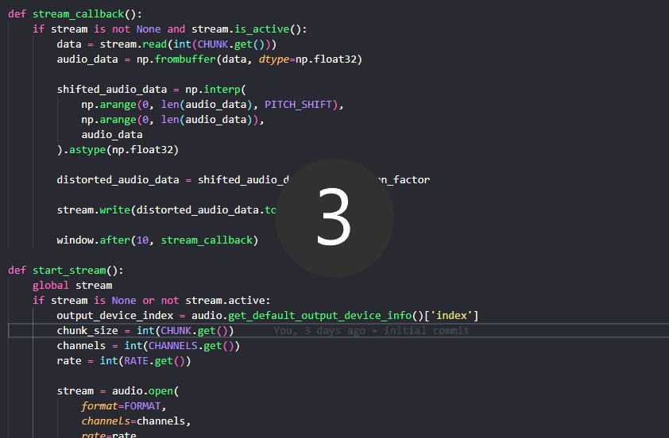

# Voicemod in Python

Real time voice modulator in python

to run it, install the packages if you don't already have them in your machine and then simply do 

```bash
python voicemod.py
```

and then a window will open. Pressing start will initialize the audio stream, so you can alter the pitch and add distortion to your voice in real time. Also, you can configure the audio's rate, channels or chunk size.

